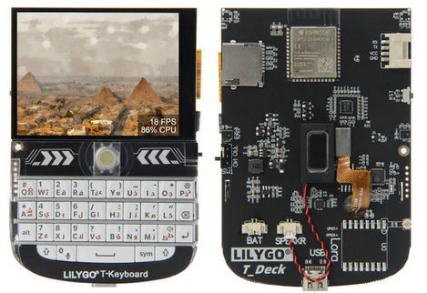
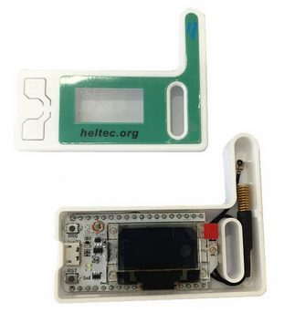
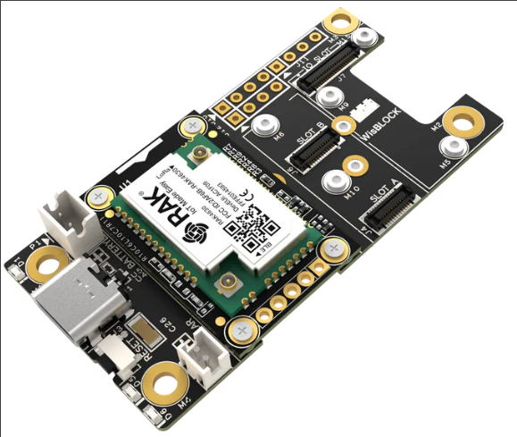

# Hardware

## Meshtastic Devices
###### LilyGo T-Deck
This is the ONLY standalone device for Meshtastic that does not require a phone to use it!

- [T-Deck](https://www.lilygo.cc/products/t-deck)
- [Case](https://www.printables.com/model/741124-lilygo-t-deck-case) *(You can 3D print it yourself, or follow the Etsy link on here to buy one)*
- [Antenna](https://www.amazon.com/dp/B086ZG5WBR)
- [GPS](https://www.amazon.com/dp/B09LQDG1HY) *(There may be a better 15mm option for the case above..)*
- [Battery](https://www.amazon.com/dp/B0BG82T39Y) *(The battery you get depends on the size of the case you order, contact me if you need help)*

___

###### LilyGo T-Beam

Popular device, I personally use it for my home station

- [T-Beam](https://www.lilygo.cc/en-ca/products/t-beam-v1-1-esp32-lora-module?variant=43059202719925)
___

###### Heltec Lora 32 V3
Great as a keychain for on the go meshtastic! Can power it directly from your phone if you want.

- [Heltec Lora 32 V3](https://heltec.org/project/wifi-lora-32-v3/)

___

###### WisBlock
These devices use an nrf52 chip instead of an esp32 chip. They are EXTREMELY low powered and are the best for solar nodes

- [WisBlock Starter Kit](https://store.rakwireless.com/products/wisblock-starter-kit?variant=41786685063366)
**Note:** Make sure you get the nrf52 Arduino core and ensure you get the right frequency for your location.