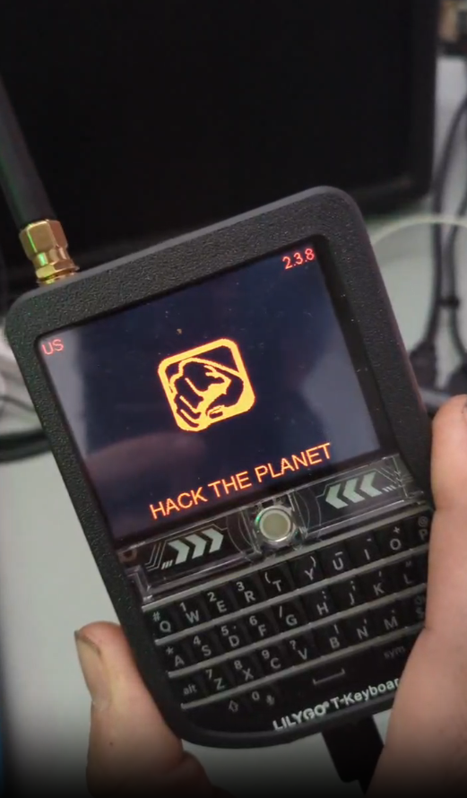

# Meshtastic Utilities

This repository serves as a collection of resources created in my journey to learn & utilize [LoRa](https://en.wikipedia.org/wiki/LoRa) based communications with [Meshtastic](https://meshtastic.org).

The goal here is to create simple & clean modules to interface with the hardware in a way that can be used to expand the possibilities of the devices capabilities.

The hardware I am experimenting with: [Lilygo T-Deck](https://www.lilygo.cc/products/t-deck), [Lilygo T-Beam](https://www.lilygo.cc/products/t-beam-v1-1-esp32-lora-module), [Heltec Lora 32 v3](https://heltec.org/project/wifi-lora-32-v3/), and [RAK Wireless 4631](https://store.rakwireless.com/products/wisblock-core-modules?variant=42440631419078)

## Documentation
- [Firmware Hacks & Customization](./FIRMWARE.md)
- [Setup Hardware](./SETUP.md)

## Bugs & Issues
- Devices must have Wifi turned off when going mobile. Upon leaving my house with WiFi still enabled, the UI & connection was EXTREMELY laggy & poor. Couldn't even type well...
- Devices using a custom MQTT with TLS & auth will cause a reboot loop *(Need to fix this ASAP)*
- A fix for the reboot loop is simply disabling MQTT over serial with `meshtastic --set mqtt.enabled false`
- `event_node` event is called **AS** we are defining the interface, so using `self.interface` in that callback will error.

## Roadmap
- Asyncronous meshtastic interface
- MQTT interface with working decryption
- Documentation on MQTT bridging for high availability
- Bridge for IRC to allow channel messages to relay over Meshtastic & all Meshtastic events to relay into IRC. *(IRC to Meshtastic will require a command like `!mesh <message here>` to avoid overloading the traffic over LoRa)*

___

###### Mirrors for this repository: [acid.vegas](https://git.acid.vegas/meshtastic) • [SuperNETs](https://git.supernets.org/acidvegas/meshtastic) • [GitHub](https://github.com/acidvegas/meshtastic) • [GitLab](https://gitlab.com/acidvegas/meshtastic) • [Codeberg](https://codeberg.org/acidvegas/meshtastic)