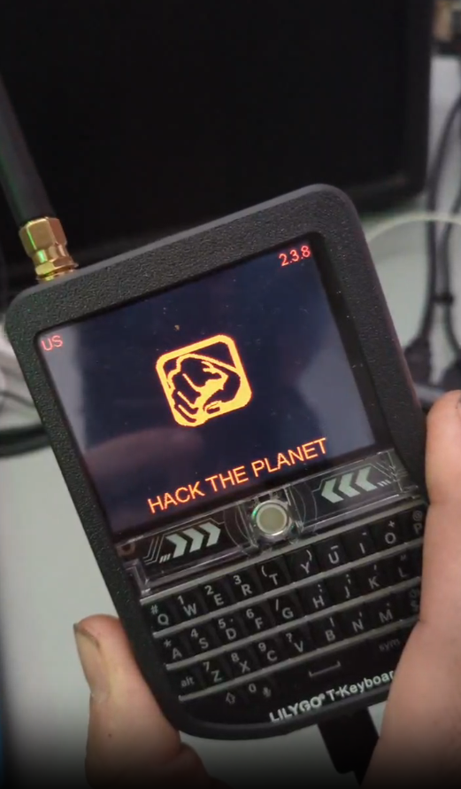

# LilyGo T-Deck Notes

## Parts
- [T-Deck](https://www.lilygo.cc/products/t-deck)
- [Case](https://www.printables.com/model/741124-lilygo-t-deck-case) *(You can 3D print it yourself, or follow the Etsy link on here to buy one)*
- [Antenna](https://www.amazon.com/dp/B086ZG5WBR)
- [GPS](https://www.amazon.com/dp/B09LQDG1HY) *(There may be a better 15mm option for the case above..)*
- [Battery](https://www.amazon.com/dp/B0BG82T39Y) *(The battery you get depends on the size of the case you order, contact me if you need help)*

**WARNING:** Do not power on the device until the antenna is plugged in! Even to flash the firmware, or for testing, make sure your antenna is plugged in or you can fry the radio!

## GPS Installation
The T-Deck has a grove connector for the GPS. Personally, I do not use a grove connector for mine, I removed the Grove input and soldered directly to the board.

**WARNING**: Be careful taking off the grove! Snip the front points, and then use a soldering iron to loosen the metal on the 4 contact back points. You can VERY easily pull the solder pads right off if you just try to rip the grove connector off without loosening the solder points. If you pull off a solder pad, you're pretty much boned on having a GPS module.

*Above: Picture of solder pads accidentally pulled off lol...*

You will see VCC, GND, RX & TX points on both the T-Deck & the GPS. Solder wires to match these points, but switch RX & TX. So do VCC to VCC, GND to GND, and then ensure that RX is soldered to TX, and TX is soldered to RX. It's confusing, I know, but that's China based hardware for you...

## Flashing
Simply plug in the T-Deck via USB and connect to a computer, then visit the [Meshtastic Web Flasher](https://flasher.meshtastic.org) and select your hardware & firmware version. Your device should show up as a serial device on /dev/ttyUSB0 or /dev/ttyAMC0. If you do not see your device, try adding your user to the dialout group. See [SETUP.md](./SETUP.md) for information on how to setup the device once it is flashed with Meshtastic.

## Issues
- Turn off WiFi completely if you plan to use this on-the-go. The device has an ESP32 chip which will always preffer WiFi over Bluetooth, so if you leave the house with this thign, it will constantly keep trying to connect to your WiFi & really degrade the performance of the board.