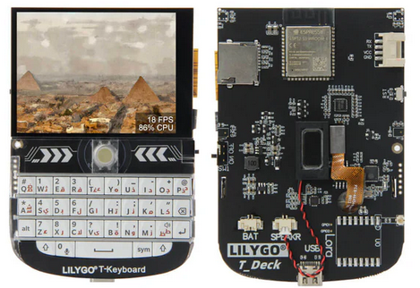
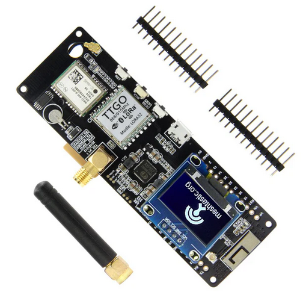
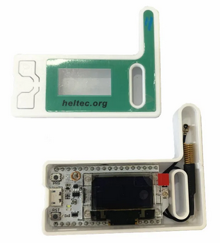
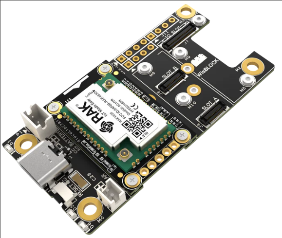

# Hardware
> A simple overview of popular hardware options for Meshtastic usage

## LilyGo T-Deck

###### Information
This is the only FULL stand-alone device that I know of for Meshtastic, that once provisioned, you do not need a phone or computer to interface with it. The device comes with a touchscreen, full keyboard, built in speaker, and more.

| Item | Cost | Description |
| ---- | ---- | ----------- |
| [T-Deck](https://www.lilygo.cc/products/t-deck) | $50 | The main LoRa microcontroller device |
| [Case](https://www.printables.com/model/741124-lilygo-t-deck-case) | Free or $25 | You can 3D print it yourself, or follow the Etsy link and buy one | 
| [Antenna](https://www.amazon.com/Connector-868-915MHz-Lora32u4-Internet-WIshiOT/dp/B07LCKNN4H) | 14$ | External antenna for better range | 
| [GPS](https://www.amazon.com/dp/B09LQDG1HY) | 18$ | There may be a better 15mm option for the case above.. | 
| [Battery](https://www.amazon.com/dp/B0BG82T39Y) | Varies | The battery you get depends on the size of the case you order, contact me if you need help |

___

## LilyGo T-Beam

###### Information
Very popular Meshtastic device. I personally use this for my home station

| Item | Cost | Description |
| ---- | ---- | ----------- |
| [T-Beam](https://www.lilygo.cc/en-ca/products/t-beam-v1-1-esp32-lora-module?variant=43059202719925) | 32$ | The main LoRa board |
| [Case](https://www.printables.com/model/127253-t-beam-case-for-meshtastic-v5) | Free | You can maybe find this case on Etsy or 3D print it yourself |

___

## Heltec Lora 32 V3
Great as a keychain for on the go meshtastic! Can power it directly from your phone if you want.

- [Heltec Lora 32 V3](https://heltec.org/project/wifi-lora-32-v3/)

___

## WisBlock
These devices use an nrf52 chip instead of an esp32 chip. They are EXTREMELY low powered and are the best for solar nodes

- [WisBlock Starter Kit](https://store.rakwireless.com/products/wisblock-starter-kit?variant=41786685063366)
**Note:** Make sure you get the nrf52 Arduino core and ensure you get the right frequency for your location.